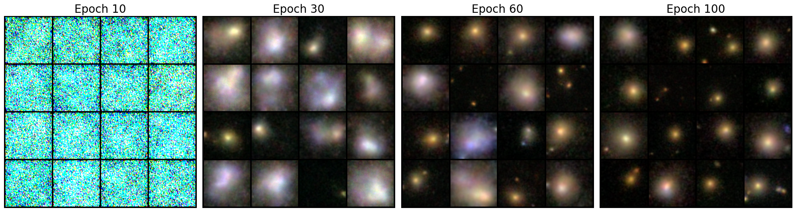
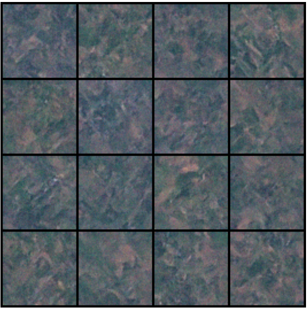
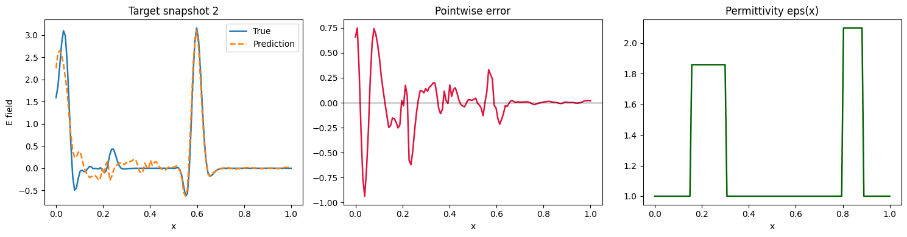

* **EuroSAT_Diffusion:** An experiment to see if a minimal score-based generative model (Residual UNet) could generate reasonable satellite imagery. It uses Denoising Score Matching and Langevin Dynamics to synthesize specific land-use classes like highways from the [EuroSAT](https://github.com/phelber/EuroSAT) dataset. 
* **ExoPlanet:** Playing around with the [NASA Exoplanet Dataset](https://archive.stsci.edu/missions-and-data/k2) to identify planetary transits in stellar light curves.
* **Galaxy_Diffusion:** Implementation of a score-based diffusion model (DDPM) to generate synthetic galaxy images. Trained on the [Galaxy10 SDSS](https://astronn.readthedocs.io/en/latest/galaxy10sdss.html) dataset, the model utilizes a Residual UNet with sinusoidal positional embeddings to learn the score function of astronomical structures, enabling the synthesis of high-fidelity spiral and elliptical galaxies from Gaussian noise.
* **Siamese_ResNet:** I implemented a [Siamese Neural Network](https://www.cs.cmu.edu/~rsalakhu/papers/oneshot1.pdf) to match faces.
* **WavePropagation:** Implementation of the [Fourier Neural Operator (FNO)](https://arxiv.org/pdf/2010.08895) as a learned alternative to traditional numerical solvers like the FDTD scheme. The FNO can be used e.g. to simulate the evolution of Electromagnetic waves.

## Galaxy Diffusion Model

## EuroSAT Diffusion Model

## Wave Propagation (Fourier Neural Operator)

